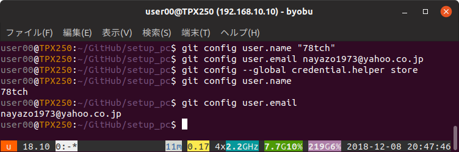

# 「apt-get」で「byobu」「git」「virtualbox」「vagrant」をインストール  
  
  ソフトのインストールは「Ubuntu ソフトウェア」からやるようになっていますが、検索しても見つからないソフトは「apt-get」でインストールします。  
  
```sh
$ sudo apt-get install byobu git virtualbox vagrant  
```  
## git の設定  
ユーザー名とメールアドレスを設定するのと、GitHub にアップロードする際に都度パスワード入力をしなくていいように、パスワードを保存する設定にします。
```sh
$ git config user.name "hogehoge"
$ git config user.email hogehoge@example.com  
$ git config --global credential.helper store  
```  
確認します。
```sh
$ git config user.name  
hogehoge  
$ git config user.email  
hogehoge@example.com  
$ git config --global credential.helper  
store  
```  
  
  
  
