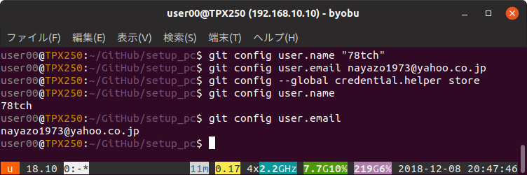

# git の設定  
ユーザー名とメールアドレスを設定するのと、GitHub にアップロードする際に都度パスワード入力をしなくていいように、パスワードを保存する設定にします。
```sh
$ git config user.name "hogehoge"
$ git config user.email hogehoge@example.com  
$ git config --global credential.helper store  
```  
  
なお、proxy 環境である場合には、以下も設定します。
```dos
mypc C:\GitHub\hoge> git config --global http.proxy "http://proxy.hogehoge.com:8080"
mypc C:\GitHub\hoge> git config --global https.proxy "https://proxy.hogehoge.com:8080"
```
    
なお、proxy 環境である場合には、以下も設定します。
```dos
mypc C:\GitHub\hoge> git config --global http.proxy "http://proxy.hogehoge.com:8080"
mypc C:\GitHub\hoge> git config --global https.proxy "https://proxy.hogehoge.com:8080"
```
  
確認します。
```sh
$ git config user.name  
hogehoge  
$ git config user.email  
hogehoge@example.com  
$ git config --global credential.helper  
store  
```  
  
  
  
