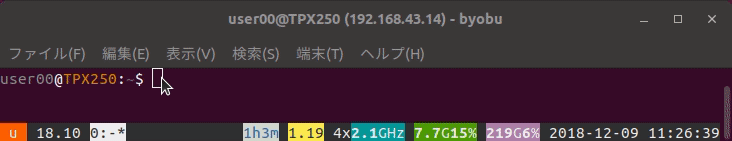

# 「/etc/inputrc」で「history-search-backward」を有効に  
  
  
Ubuntu のデフォルトのシェルはBash（Dash）ですが、初期設定では「history-search-backward」が無効になっていますので、有効にします。  

これはどういう機能かというと、コマンド実行履歴からコマンドを呼び出す際に、数文字入力しておくと、その数文字に前方一致する履歴だけを順に呼び出してくれる、という機能です。  
標準でも、上矢印キーを押せば、コマンド実行履歴をひとつずつさかのぼって呼び出すことができると思いますが、遠い昔に実行したコマンドの場合、なかなか呼び出せません。部分一致で呼び出す機能もありますが、呼び出したいコマンド以外のものもヒットしてしまったりします。  
ということで、「history-search-backwarcd/forward」はとにかく便利で、邪魔になる設定でもないと思うのでおすすめです。システム全体に反映させるには「/etc/inputrc」で設定し、カレントユーザーのみに反映させるには「~/.bashrc」で設定します。  
  　
1. まずは<kbd>$ sudo vi /etc/inputrc</kbd>  
2. <kbd>:/history</kbd>、<kbd>n</kbd>連打で「history-search-backward」の箇所を探す。  
3. <kbd>y2</kbd>、<kbd>p</kbd>で２行コピペ。  
4. 行頭の「# 」を削除するのと、「"\e[5~"」を「"\e[A"」に、「"\e[6~"」を「"\e[B"」に変更。これは、「page up/down」キーで呼び出すところを、「上下矢印キー」で呼び出す、に変更するという趣旨です。以下のようにします。  
```sh
# alternate mappings for "page up" and "page down" to search the history  
# "\e[5~": history-search-backward
# "\e[6~"": history-search-forward
"\e[A": history-search-backward  
"\e[B": history-search-forward  
```  
5. 設定を有効にするには、一度ログオフしてログインし直します。  
  
6. ちなみに、それ以外のキーに設定したい場合に、どのように指定したらいいかを確認するには、cat コマンドを使います。  <kbd>cat</kbd>と打ってEnter、設定したいキーを押下。例では上下左右と押下しています。「^[」を除いた部分を指定時に使います。調べ終わったら、<kbd>Ctrl + c </kbd>で抜けられます。
```sh
$ cat  
^[[A^[[B^[[D^[[C
```  

7. ほかにも、「/etc/inputrc」をよくみると、コメントアウトされているものも含めていろいろな設定がありますね。