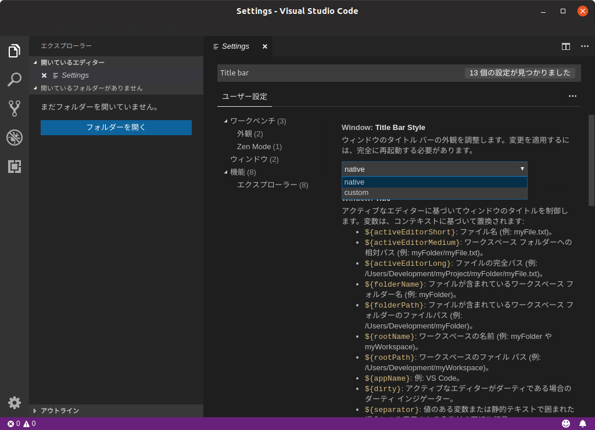
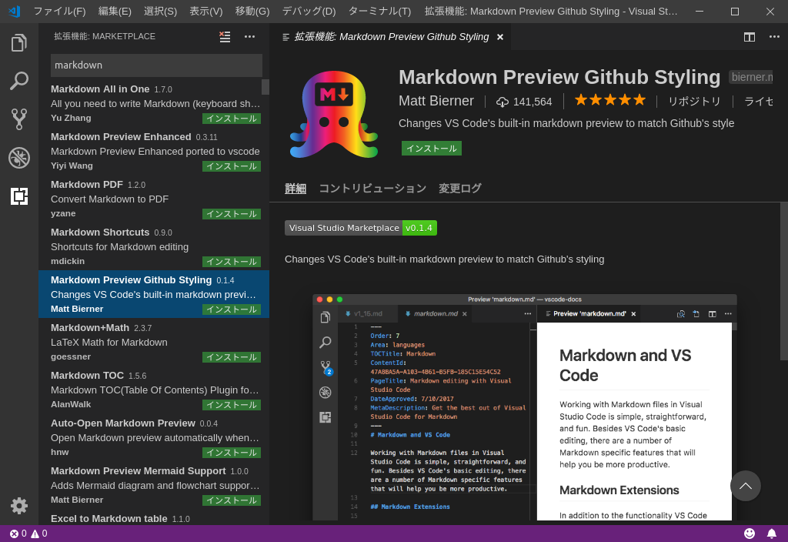
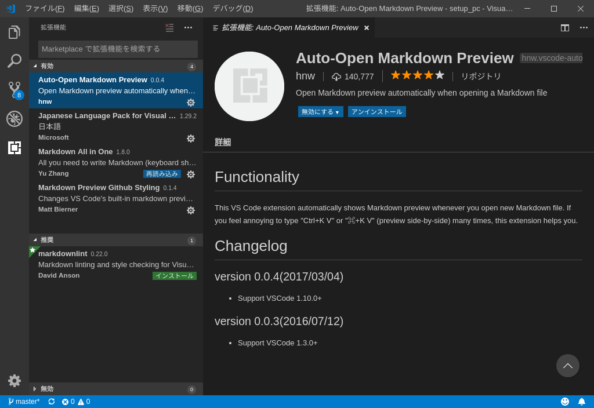
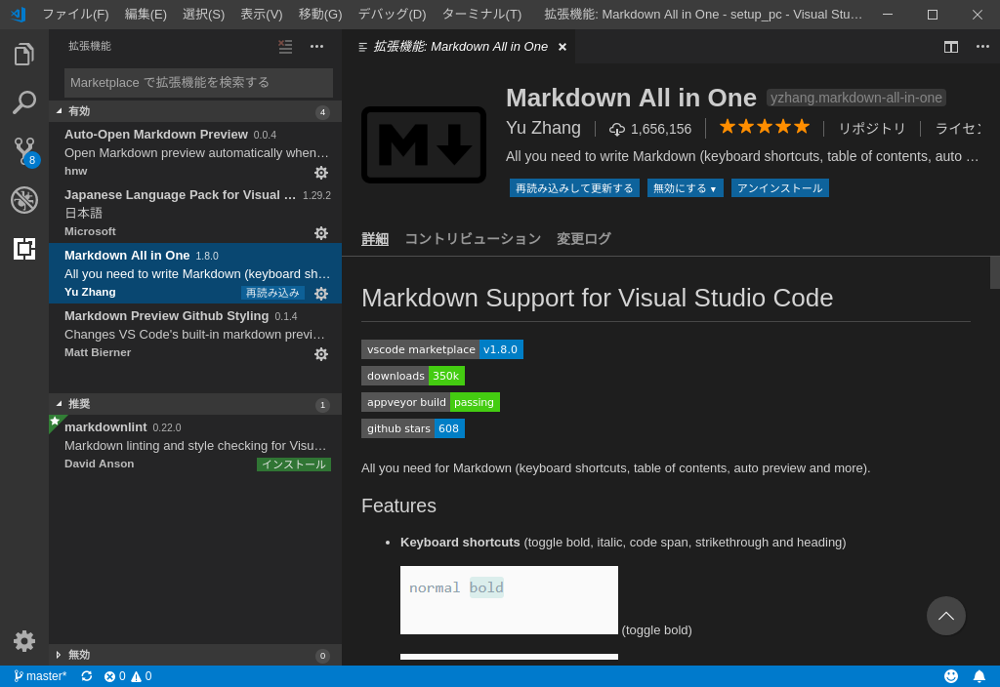

# Visual Studio Code の設定  
日本語化と、Markdown を書くのに便利な拡張機能をインストールします。  

```sh
$ git config user.name "hogehoge"
$ git config user.email hogehoge@example.com  
$ git config --global credential.helper store  
```  
## 拡張機能
1. 「Japanese Language Pack for VS Code」
1. 「Markdown Preview Github Styling」
1. 「Auto-Open Markdown Preview」
1. 「docs-markdown」
1. 「indent-rainbow」
1. 「Rainbow CSV」
1. 「Edit csv」
1. 「Hex Editor」

  
  
  
  
  
  
  
機能 `test` という。
> [!TIP]
> Optional information to help a user be more successful
  
> [!NOTE]
> Information the user should notice even if skimming
  
> [!CAUTION]
> Negative potential consequences of an action
  
> [!WARNING]
> Dangerous certain consequences of an action
  
- test1
- test2
- test3
  
:::row:::
    :::column:::
        
    :::column-end:::
    :::column:::
        
    :::column-end:::
:::row-end:::
  
[test](https://www.example.com)
  
:::image type="content" source="images/fstab1.png" alt-text="test":::
  
